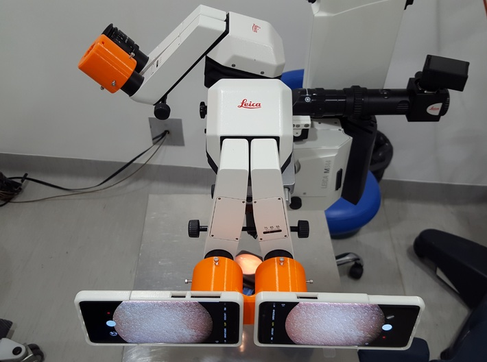
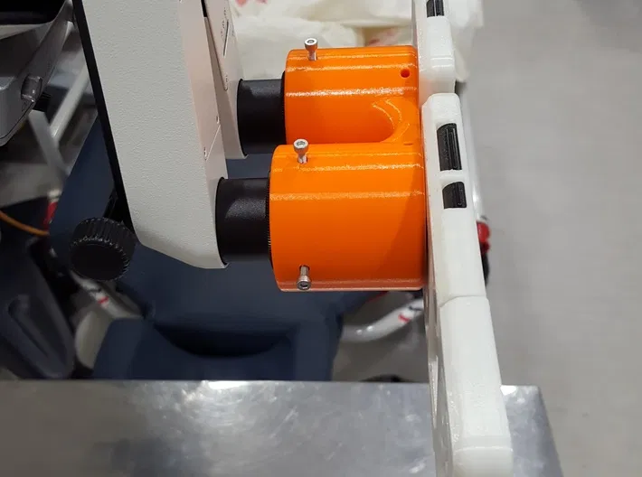
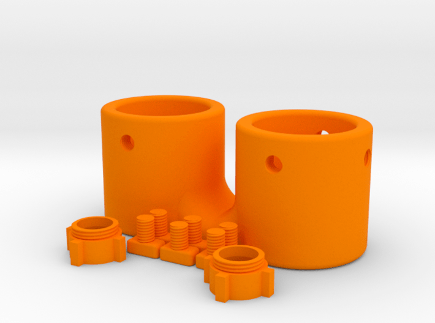

# Micro3D for Leica by Custom Surgical

This repository contains 3D models of the parts of the Micro3D, a system to record stereoscopic videos on your microscope using 2 smartphones.

Please, watch the intro video below:

The system occupies 2 oculars of the microscope and aligns the smartphone cameras with the path of light of the microscope.

A view of the Micro3D set up can be observed below:

## System components and setup

### Necessary components

- 1x Micro3D.stl part (to be found in this repository under the "3D files" folder)
- 6x Screw.stl parts (to be found in this repository under the "3D files" folder)
- 2x Eyepiece_15mm.stl parts (to be found in this repository under the "3D files" folder)
- 2x Custom Surgical phone cases (if you do not have, you can visit [customsurgical.de](https://customsurgical.de) and order them there)
- 4x M3 25mm screws
- 4x M3 hexagonal nuts (6mm long diameter x 2.4mm height is fine, but several sizes may fit)
- 2x smartphones with recording capabilities
- 1x microscopic system

### Setup

1. Print the 3D models (we recommend PA12 as a suitable printing material due to the following reasons: robust polyamide material, chemically resistant, easy to clean, safe to use in a medical environment).
2. Put on the cases in the corresponding smartphones.
3. Couple the printed eyepieces to the camera of the smartphones using the thread of the cases.
4. Insert the eyepieces of the smartphones in the matching entrance of the Micro3D.
5. Secure the smartphones to the Micro3D by screwing the screws to the nuts using the provided space in the Micro3D.
6. Connect the Micro3D to the ocular of the microscope.
7. Secure the Micro3D to the oculars by screwing the printed screws to the appropriate holes.
8. Turn on your smartphone cameras and start recording! (for syncing the video frames, you can apply post-processing after capture or use syncing applications to align times of both devices).
